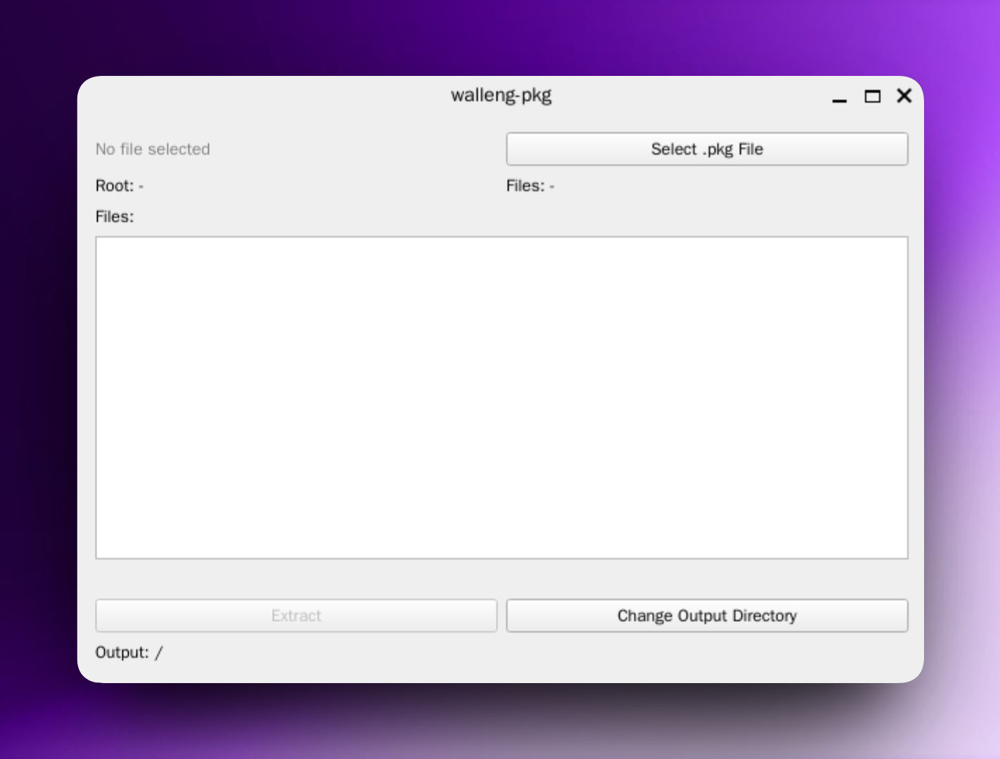

# walleng-pkg

Decompress `.pkg` files from Wallpaper Engine.

## Requirements

- Python 3.10+

## Installation

```bash
pip install .
```

Or install in development mode:

```bash
pip install -e .
```

**Note:** PySide6 is required and will be installed automatically.

## Testing

```bash
pip install pytest
pytest
```

Or install dev dependencies and run:

```bash
pip install -e ".[dev]"
pytest
```

## Usage

### Graphical Interface



```bash
walleng-pkg-gui
```

Features:
- File browser to select .pkg files
- Preview of package contents before extraction
- Configurable output directory
- Progress indication during extraction
- Cross-platform (Windows, macOS, Linux)

### Command Line

```bash
walleng-pkg archivo.pkg
walleng-pkg archivo.pkg -o /ruta/salida
walleng-pkg archivo.pkg -v
walleng-pkg archivo.pkg -l
```

**Options:**

- `package` - Path to the .pkg file to extract
- `-o, --output` - Output directory (defaults to current directory)
- `-v, --verbose` - Print extracted file names
- `-l, --list` - List package contents without extracting

### Python API

```python
from walleng_pkg.core import extract_package, parse_package

# Extract all files
extracted = extract_package("archivo.pkg")

# Extract to specific directory
extracted = extract_package("archivo.pkg", "/ruta/salida")

# Parse without extracting
info = parse_package("archivo.pkg")
print(f"Root: {info.root}")
for f in info.files:
    print(f"  {f.name} ({f.length} bytes)")
```

## File Format

The `.pkg` format structure:

1. **Root path** - Length-prefixed null-terminated string
2. **Number of files** - 4-byte unsigned integer (little-endian)
3. **File entries** (repeated):
   - Filename - Length-prefixed null-terminated string
   - Offset - 4-byte unsigned integer
   - Length - 4-byte unsigned integer
4. **File data** - Raw binary data concatenated

## Project Structure

```
.
├── pyproject.toml          # Package configuration
├── README.md
├── .gitignore
├── assets/
│   └── gui.png             # GUI screenshot
├── src/
│   └── walleng_pkg/
│       ├── __init__.py
│       ├── core.py         # Core extraction logic
│       ├── cli.py          # Command-line interface
│       └── gui.py          # Graphical interface (PySide6)
└── tests/
    └── test_core.py        # Unit tests
```

## License

MIT
